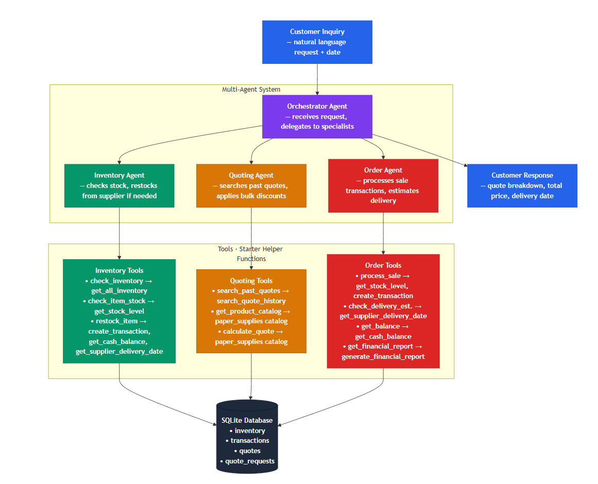

# Munder Difflin Paper Company — Multi-Agent System

**Course:** Multi-Agent Systems
**Submission:** February 17, 2026

A multi-agent AI system that automates inventory management, quote generation, and order fulfillment for a fictional paper manufacturing company. Built with the **smolagents** framework and **GPT-4o**.

---

## How It Works

A customer sends a natural language request (e.g., *"I need 500 sheets of glossy paper and 200 sheets of cardstock for our festival"*). The system coordinates 4 specialized agents to check stock, generate a quote with bulk discounts, process the sale, and respond — all automatically.

### Agent Architecture

| Agent | Role | Tools |
|-------|------|-------|
| **Orchestrator** | Receives the customer request, delegates to worker agents in sequence, combines results into a final response | None (manages the 3 agents below) |
| **Inventory Agent** | Looks up the product catalog, checks stock levels, restocks from suppliers if needed | `check_inventory`, `check_item_stock`, `restock_item`, `get_product_catalog` |
| **Quoting Agent** | Searches past quotes for pricing reference, calculates itemized quotes with bulk discounts | `search_past_quotes`, `get_product_catalog`, `calculate_quote` |
| **Order Agent** | Processes sale transactions, checks delivery estimates, monitors cash balance | `process_sale`, `check_delivery_estimate`, `get_balance`, `get_financial_report` |

### Workflow Diagram



### Processing Flow

```
Customer Request → Orchestrator
                      │
                      ├── 1. Inventory Agent → Check catalog, verify stock, restock if needed
                      ├── 2. Quoting Agent   → Look up past quotes, calculate price with discounts
                      └── 3. Order Agent     → Process sale, record transactions, estimate delivery
                      │
                      v
                   Orchestrator combines results → Customer Response
```

---

## Submitted Files

| File | Description |
|------|-------------|
| `project_starter.py` | Main implementation — model setup, 10 tool definitions, 4 agent definitions, test runner with retry logic |
| `reflection.md` | Reflection report — architecture analysis, evaluation results, improvement suggestions |
| `workflow_diagram.md` | Mermaid workflow diagram showing agents, tools, helper functions, and data flow |
| `workflow_diagram.png` | Rendered image of the workflow diagram |
| `test_results.csv` | Output from running all 20 test scenarios |
| `full_run_output.txt` | Complete terminal output from the test run (12,214 lines, ANSI-stripped) |
| `requirements.txt` | Python package dependencies |
| `.env.example` | Template for the API key environment variable |
| `README.md` | This file — project overview and documentation |

### Data Files (Provided as Starter Code)

| File | Description |
|------|-------------|
| `quotes.csv` | 108 historical quotes for pricing reference |
| `quote_requests.csv` | 108 past customer requests |
| `quote_requests_sample.csv` | 20 test scenarios used for evaluation |

---

## Setup

### Requirements

- Python 3.10+
- OpenAI-compatible API key (Vocareum proxy)

### Installation

```bash
# Create virtual environment
uv venv --python 3.12
source .venv/bin/activate  # Linux/Mac
# .venv\Scripts\activate   # Windows

# Install dependencies
pip install -r requirements.txt
```

### Configuration

Copy `.env.example` to `.env` and add your API key:

```
UDACITY_OPENAI_API_KEY=your_api_key_here
```

The system uses the OpenAI-compatible proxy at `https://openai.vocareum.com/v1` with the `gpt-4o` model.

### Run

```bash
python project_starter.py
```

This will:
1. Initialize the SQLite database with inventory, transactions, and historical quotes
2. Process all 20 customer test scenarios
3. Save results to `test_results.csv`
4. Auto-log all terminal output to `full_run_output.txt`

---

## Key Features

- **4-agent architecture** — Orchestrator + 3 specialist agents (within the 5-agent maximum)
- **10 tools** wrapping 7 starter helper functions with validation and business logic
- **Bulk discounts** — Tiered pricing: 5% (100-499 units), 10% (500-999), 15% (1000+)
- **Catalog name resolution** — Inventory agent maps informal customer names to exact catalog names
- **Retry logic** — 3 attempts per request with exponential backoff (2s, 4s delays)
- **Error sanitization** — Raw API errors logged to console only; customer sees friendly messages
- **Automatic logging** — TeeOutput class writes to terminal and clean log file simultaneously
- **Safety checks** — Stock verified before selling, cash verified before restocking

---

## Test Results

From the evaluation run against 20 customer scenarios:

- **20 of 20** requests fully processed
- **12 requests** changed the cash balance (sales and restocking)
- **8+ orders** successfully fulfilled
- Starting state: Cash $45,059.70 | Inventory $4,940.30
- Final state: Cash $43,672.98 | Inventory $5,000.75

---

## Technology Stack

- **Framework:** smolagents (`ToolCallingAgent`)
- **LLM:** GPT-4o via OpenAI-compatible API
- **Database:** SQLite via SQLAlchemy
- **Language:** Python 3.12
