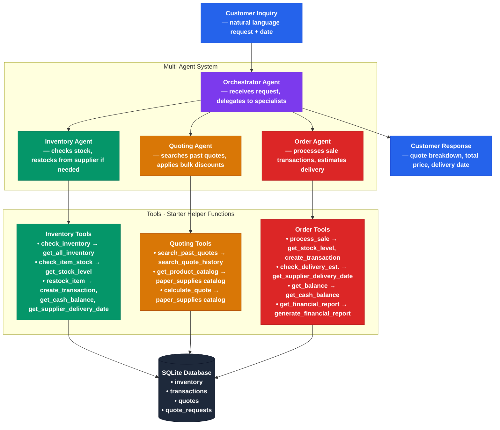

# Munder Difflin Multi-Agent System — Workflow Diagram

```mermaid
flowchart TD
    classDef blue fill:#2563eb,stroke:#1d4ed8,color:#fff,font-weight:bold
    classDef purple fill:#7c3aed,stroke:#6d28d9,color:#fff,font-weight:bold
    classDef green fill:#059669,stroke:#047857,color:#fff,font-weight:bold
    classDef orange fill:#d97706,stroke:#b45309,color:#fff,font-weight:bold
    classDef red fill:#dc2626,stroke:#b91c1c,color:#fff,font-weight:bold
    classDef dark fill:#1e293b,stroke:#0f172a,color:#fff,font-weight:bold

    IN["Customer Inquiry<br/>— natural language request + date"]:::blue

    subgraph SYSTEM["Multi-Agent System"]
        direction TB
        ORCH["Orchestrator Agent<br/>— receives request, delegates to specialists"]:::purple
        INV["Inventory Agent<br/>— checks stock, restocks from supplier if needed"]:::green
        QUO["Quoting Agent<br/>— searches past quotes, applies bulk discounts"]:::orange
        ORD["Order Agent<br/>— processes sale transactions, estimates delivery"]:::red
        ORCH --> INV & QUO & ORD
    end

    subgraph TOOLS["Tools · Starter Helper Functions"]
        direction TB
        IT["Inventory Tools<br/>• check_inventory → get_all_inventory<br/>• check_item_stock → get_stock_level<br/>• restock_item → create_transaction,<br/>get_cash_balance, get_supplier_delivery_date"]:::green
        QT["Quoting Tools<br/>• search_past_quotes → search_quote_history<br/>• get_product_catalog → paper_supplies catalog<br/>• calculate_quote → paper_supplies catalog"]:::orange
        OT["Order Tools<br/>• process_sale → get_stock_level, create_transaction<br/>• check_delivery_est. → get_supplier_delivery_date<br/>• get_balance → get_cash_balance<br/>• get_financial_report → generate_financial_report"]:::red
    end

    DB[("SQLite Database<br/>• inventory<br/>• transactions<br/>• quotes<br/>• quote_requests")]:::dark

    OUT["Customer Response<br/>— quote breakdown, total price, delivery date"]:::blue

    IN --> ORCH
    INV --> IT
    QUO --> QT
    ORD --> OT
    IT & QT & OT --> DB
    ORCH --> OUT
```
